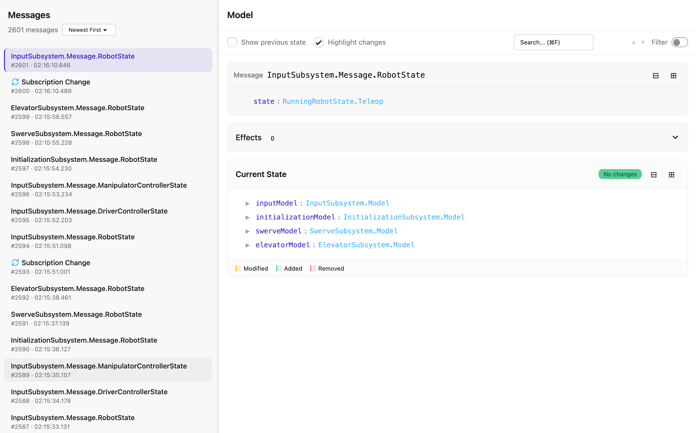
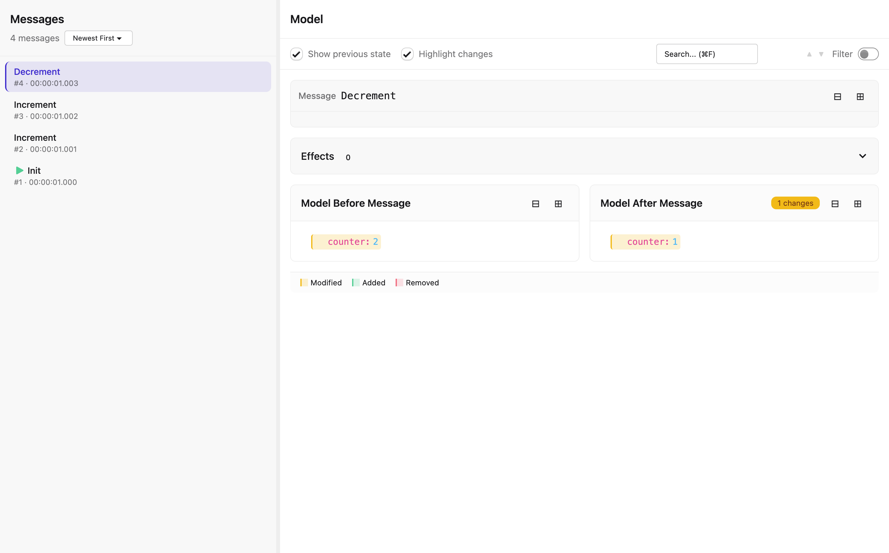

# TeaForge Debugger

A desktop application for debugging TeaForge applications.





## Overview

TeaForge Debugger helps you understand what's happening in your application by letting you step through every message and see exactly how your model changes over time. It reads log files generated by a TeaForge-instrumented application and provides an interactive interface for exploring state changes.

## Features

### State Comparison

- **Single view**: See the current state after a message was processed
- **Split view**: Enable "Show previous state" to see before and after states side-by-side
- **Change highlighting**: Enable "Highlight changes" to see which values were modified, added, or removed

### Search and Filter

- Press `Meta+F` (`Cmd+F` or `Ctrl+F`) to search within the state tree
- Navigate between matches with Enter/Shift+Enter or the arrow buttons
- Enable "Filter" mode to show only paths that match your search query

### Tree Navigation

- Expand and collapse nodes to explore nested data structures
- Use the collapse/expand all buttons to quickly navigate large state trees
- Changed values are auto-expanded when change highlighting is enabled

### Effects Inspector

View the commands (effects) produced by each message. The effects panel shows HTTP requests, navigation commands, and other side effects your application triggered.

### Live Streaming via WebSocket

Connect to a running application in real-time via WebSocket. Instead of loading a static log file, you can stream log entries as they happen:

1. Click the "WebSocket" button in the app
2. Enter the WebSocket URL of your instrumented application
3. Watch messages arrive in real-time as your application runs

The app remembers your recent WebSocket URLs for quick reconnection.

## Getting Started

1. Download the application for your platform from the [Releases](https://github.com/teaforge/teaforge-debugger/releases) page
2. Load log data using one of these methods:
   - Open a log file (`.jsonl`) via File > Open or `Meta+O`
   - Connect to a live WebSocket stream via the "WebSocket" button
3. Select a message from the sidebar to inspect its state

## Keyboard Shortcuts

| Shortcut      | Action                |
| ------------- | --------------------- |
| `Meta+O`      | Open file             |
| `Meta+F`      | Focus search          |
| `↑` / `↓`     | Navigate messages     |
| `Enter`       | Next search match     |
| `Shift+Enter` | Previous search match |

## Log File Format

TeaForge Debugger reads JSONL (JSON Lines) files where each line is a JSON object representing an event. The file contains:

- **Header**: Metadata about the log file
- **Init**: Initial application state and bootstrap effects
- **Update**: Each message processed, with the resulting model state and effects
- **Subscription changes**: When subscriptions start or stop

---

# Development

## Requirements

- Node.js 20+
- Elm 0.19.1

## Development Setup

```bash
# Install dependencies
npm install

# Build the application (Elm + CSS)
npm run build

# Run the application
npm start
```

### Development with Hot Reload

```bash
# In one terminal, watch Elm files
npm run watch:elm

# In another terminal, watch CSS files
npm run watch:css

# Run the app
npm start
```

## Testing

```bash
# Run Elm tests
npx elm-test
```

## Building Distributions

### Prerequisites

For full icon generation, install ImageMagick:

```bash
# macOS
brew install imagemagick

# Ubuntu/Debian
sudo apt-get install imagemagick
```

### Generate Icons

Before building distributions, generate platform-specific icons from the source image:

```bash
./scripts/generate-icons.sh
```

This creates icons in `build/` from `docs/teaforge-icon.png`.

### Build Commands

```bash
# Build for current platform
npm run dist

# Build for specific platforms
npm run dist:mac      # macOS (DMG + ZIP for x64 and arm64)
npm run dist:win      # Windows (NSIS installer + portable for x64/arm64)
npm run dist:linux    # Linux (AppImage + Flatpak)
```

Build outputs are placed in the `release/` directory.

## Releasing

1. Update the version in `package.json`
2. Commit and push to `main`
3. Go to GitHub Actions > "Release" > "Run workflow"
4. The workflow will:
   - Read the version from `package.json`
   - Check that the tag doesn't already exist
   - Create and push a `v{version}` tag
   - Build for all platforms and create a draft GitHub Release
5. Review the draft release on GitHub and publish when ready

## CI/CD Workflows

| Workflow      | Trigger           | Purpose                                              |
| ------------- | ----------------- | ---------------------------------------------------- |
| `ci.yml`      | Push to main, PRs | Builds and runs tests                                |
| `release.yml` | Manual dispatch   | Creates version tag and builds for all platforms     |

## Code Signing

The current configuration does not include code signing. Users may see security warnings:

- **macOS**: Right-click the app and select "Open" to bypass Gatekeeper
- **Windows**: Click "More info" then "Run anyway" on SmartScreen

Code signing can be added later by configuring certificates in the GitHub Actions secrets.

## Project Structure

```
├── src/                  # Elm source files
├── dist/                 # Build outputs (elm.js, styles.css, icons)
├── build/                # electron-builder resources (icons, entitlements)
├── scripts/              # Build and utility scripts
├── release/              # Distribution outputs (gitignored)
├── main.js               # Electron main process
├── preload.js            # Electron preload script
├── index.html            # Renderer HTML
├── electron-builder.yml  # Distribution build configuration
└── package.json          # Dependencies and scripts
```

## License

MIT
